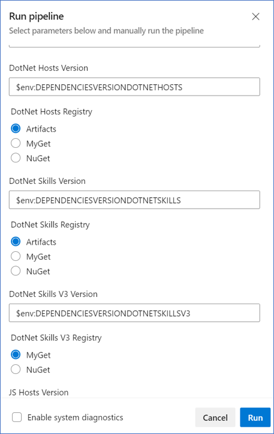
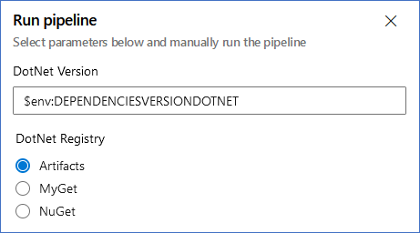

# Pipelines

This page describes the four pipelines that will need to be created to run functional tests.

[Create Shared Resources Pipeline](#01---create-shared-resources-pipeline) : Creates all the long-term resources required to deploy the bots and run tests (executed manually).

[Deploy Bot Resources Pipeline](#02---deploy-bot-resources-pipeline) : Builds and deploys test bot resources to be used in the functional tests (executed nightly).

[Run Test Scenarios Pipeline](#03---run-test-scenarios-pipeline) : Runs nightly after the previous pipeline finishes and configures and executes the test scenarios.

[Cleanup Resources Pipeline](#04---cleanup-resources-pipeline) : Deletes all the resources created for running the functional tests (executed manually).

## 01 - Create Shared Resources Pipeline

- **YAML**: [build\yaml\sharedResources\createSharedResources.yml](../build/yaml/sharedResources/createSharedResources.yml)

| Variable Name                    | Source       | Description                                                                                                                                                         | Default value   | Example                              |
| -------------------------------- | ------------ | ------------------------------------------------------------------------------------------------------------------------------------------------------------------- | --------------- | ------------------------------------ |
| **AzureSubscription**            | Azure DevOps | Name of the Azure Resource Manager Service Connection configured in the DevOps organization. Click [here](./addARMServiceConnection.md) to see how to set it up.    | -               | TestSubscription                     |
| **AppServicePlanDotNetName**     | User         | Name of the App Service Plan for DotNet bots.                                                                                                                       | -               | appservicedotnet                     |
| **AppServicePlanJSName**         | User         | Name of the App Service Plan for JavaScript bots.                                                                                                                   | -               | appservicejs                         |
| **AppServicePlanPythonName**     | User         | Name of the App Service Plan for Python bots.                                                                                                                       | -               | appservicepython                     |
| **AppServicePlanPricingTier**    | User         | (optional) Pricing Tier for App Service Plans.                                                                                                                      | **F1**          | S1                                   |
| **ContainerRegistryPricingTier** | User         | (optional) Pricing Tier for Container Registry.                                                                                                                     | **Basic**       | Standard                             |
| **KeyVaultObjectId**             | Azure        | (optional) Suscription's Object Id to create the keyvault to store App Registrations in Azure. Click [here](./getServicePrincipalObjectID.md) to see how to get it. | -               | 0x0x0x0x-0x00-000x-xx0x-000000000x00 |
| **ResourceGroupName**            | User         | (optional) Name for the resource group that will contain the shared resources.                                                                                      | **BFFN-Shared** | shared-resource-group                |
| **ResourceSuffix**               | User         | (optional) Alphanumeric suffix to add to the resources' name to avoid collisions (use lowercase, only letters and numbers).                                         | -               | suffix                               |

## 02 - Deploy Bot Resources Pipeline

- **YAML**: [build\yaml\deployBotResources\deployBotResources.yml](../build/yaml/deployBotResources/deployBotResources.yml)

| Variable Name                | Source                         | Description                                                                                                                                                      | Default value                              | Example                 |
| ---------------------------- | ------------------------------ | ---------------------------------------------------------------------------------------------------------------------------------------------------------------- | ------------------------------------------ | ----------------------- |
| **AzureSubscription**        | Azure DevOps                   | Name of the Azure Resource Manager Service Connection configured in the DevOps organization. Click [here](./addARMServiceConnection.md) to see how to set it up. | -                                          | TestSubscription        |
| **AppServicePlanDotNetName** | User / Create Shared Resources | Name of the App Service Plan for DotNet bots.                                                                                                                    | -                                          | appservicedotnet        |
| **AppServicePlanJSName**     | User / Create Shared Resources | Name of the App Service Plan for JavaScript bots.                                                                                                                | -                                          | appservicejs            |
| **AppServicePlanPythonName** | User / Create Shared Resources | Name of the App Service Plan for Python bots.                                                                                                                    | -                                          | appservicepython        |
| **BotPricingTier**           | User                           | (optional) Pricing tier for the Web App resources.                                                                                                               | **F0**                                     | S1                      |
| **ContainerRegistryName**    | User / Create Shared Resources | (optional) Name of the Container Registry where the bots are located.                                                                                            | **bffncontainerregistry + ResourceSuffix** | containerregistrysuffix |
| **ConnectionName**           | User                           | (optional) Name for the OAuth connection to use in the skill bots.                                                                                               | **TestOAuthProvider**                      | TestOAuthProvider       |
| **ResourceGroup**            | User                           | (optional) Name of the Resource Group where the bots will be deployed.                                                                                           | **BFFN**                                   | bots-group              |
| **ResourceSuffix**           | Create Shared Resources        | (optional) Alphanumeric suffix to add to the resources' name to avoid collisions (use lowercase, only letters and numbers).                                      | -                                          | suffix                  |
| **SharedResourceGroup**      | Create Shared Resources        | (optional) Name of the Shared Resource Group where the shared resources are deployed.                                                                            | **BFFN-Shared**                            | shared-resource-group   |
| **VirtualNetworkName**       | User / Create Shared Resources | (optional) Name of the Virtual Network containing the subnets for each bot language.                                                                             | **bffnvirtualnetwork + ResourceSuffix**    | virtualnetworksuffix    |

### List of Bots AppIDs and Secrets

The pipeline need to have a pair of these variables for each bot (see [Available Bots List](./availableBotsList.md)).

These variables are optional, no need to configure them if the key vault was created in [Create Shared Resources](#01---create-shared-resources-pipeline) pipeline.

| Variable Name           | Source                                                                                                        | Description                   | Default value | Example                            |
| ----------------------- | ------------------------------------------------------------------------------------------------------------- | ----------------------------- | ------------- | ---------------------------------- |
| **BotName + AppId**     | [App Registration Portal](https://portal.azure.com/#blade/Microsoft_AAD_RegisteredApps/ApplicationsListBlade) | (optional) App ID to use.     | -             | x0x000x-000x-000x-xxx0-x00x0000xxx |
| **BotName + AppSecret** | [App Registration Portal](https://portal.azure.com/#blade/Microsoft_AAD_RegisteredApps/ApplicationsListBlade) | (optional) App Secret to use. | -             | x0x000x-000x-000x-xxx0-x00x0000xxx |

This repo contains a script to create badges of App Registrations to ease pipeline setup. Follow the instruction in [Setup App Registrations](./setupAppRegistrations.md) page.

### Dependency Variables

The following parameters will be displayed in the run pipeline blade.

The version parameters can be set here or you can create variables to set the values for the next pipeline's runs.
Supported values are: LATEST (default), STABLE, or a specific version.
For example:
DEPENDENCIESVERSIONDOTNETHOSTS = 4.13.1

| Parameter Name                                      | Source | Description                                                                                              | Default value | Example   |
| --------------------------------------------------- | ------ | -------------------------------------------------------------------------------------------------------- | ------------- | --------- |
| **DependenciesVersion + DotNet/JS/Python + Hosts**  | User   | (optional) Source from which the Bot Builder dependencies will be downloaded for selected host bots.     | -             | NuGet     |
| **DependenciesVersion + DotNet/JS/Python + Skills** | User   | (optional) Source from which the Bot Builder dependencies will be downloaded for selected skill bots.    | -             | Artifacts |
| **DependenciesVersion + DotNet/JS + SkillsV3**      | User   | (optional) Source from which the Bot Builder dependencies will be downloaded for selected V3 skill bots. | -             | MyGet     |
| **DependenciesVersion + DotNet/JS/Python + Hosts**  | User   | (optional) Bot Builder dependency version to use for selected host bots.                                 | -             | LATEST    |
| **DependenciesVersion + DotNet/JS/Python + Skills** | User   | (optional) Bot Builder dependency version to use for selected skill bots.                                | -             | STABLE    |
| **DependenciesVersion + DotNet/JS + SkillsV3**      | User   | (optional) Bot Builder dependency version to use for selected V3 skill bots.                             | -             | 3.30.0    |

These are the available registry options for each bot language:

- DotNet
  - Artifacts (default)
  - MyGet (default for V3 skill)
  - NuGet
- JS
  - MyGet (default)
  - Npm
- Python (Not available for SkillsV3)
  - Artifacts (default)
  - Pypi
  - Test.Pypi

Supported Version inputs are:

| Name                 | Description                                                                                                                 | Example |
| -------------------- | --------------------------------------------------------------------------------------------------------------------------- | ------- |
| **LATEST**           | (default) The latest published version available in the chosen registry, it will search for `stable` or `preview` versions. | LATEST  |
| **STABLE**           | The latest stable published version available in the chosen registry, it will only search for `stable` versions.            | STABLE  |
| **Specific Version** | Version format based on how it's published in the chosen registry.                                                          | 4.13.0  |

## 03 - Run Test Scenarios Pipeline

- **YAML**: [build\yaml\testScenarios\runTestScenarios.yml](../build/yaml/testScenarios/runTestScenarios.yml)

| Variable Name                                 | Source                                                                                                        | Description                                                                                                                                                      | Default value   | Example                            |
| --------------------------------------------- | ------------------------------------------------------------------------------------------------------------- | ---------------------------------------------------------------------------------------------------------------------------------------------------------------- | --------------- | ---------------------------------- |
| **AzureSubscription**                         | Azure DevOps                                                                                                  | Name of the Azure Resource Manager Service Connection configured in the DevOps organization. Click [here](./addARMServiceConnection.md) to see how to set it up. |                 | TestSubscription                   |
| **AppServicePlanDotNetName**                  | User / Create Shared Resources                                                                                | Name of the App Service Plan for DotNet bots.                                                                                                                    | -               | appservicedotnet                   |
| **AppServicePlanJSName**                      | User / Create Shared Resources                                                                                | Name of the App Service Plan for JavaScript bots.                                                                                                                | -               | appservicejs                       |
| **AppServicePlanPythonName**                  | User / Create Shared Resources                                                                                | Name of the App Service Plan for Python bots.                                                                                                                    | -               | appservicepython                   |
| **ResourceGroup**                             | User                                                                                                          | (optional) Name of the Resource Group where the bots are deployed.                                                                                               |                 | bots-group                         |
| **ResourceSuffix**                            | Create Shared Resources                                                                                       | (optional) Suffix to add to the resources' name to avoid collitions (use lowercase, only letters and numbers).                                                   |                 | suffix                             |
| **[BotName](./availableBotsList.md) + AppId** | [App Registration Portal](https://portal.azure.com/#blade/Microsoft_AAD_RegisteredApps/ApplicationsListBlade) | (optional) Skill Bot App ID to use. If not configured, it will be retrieved from the key vault.                                                                  |                 | x0x000x-000x-000x-xxx0-x00x0000xxx |
| **SharedResourceGroup**                       | Create Shared Resources                                                                                       | (optional) Name of the Shared Resource Group where the shared resources are deployed.                                                                            | **BFFN-Shared** | shared-resource-group              |

### Dependency Variables

The following parameters will be displayed in the run pipeline blade.

The version parameters can be set here or you can create variables to set the values for the next pipeline's runs.
Supported values are: LATEST (default), STABLE, or a specific version.
For example:
DEPENDENCIESVERSIONDOTNET = 4.13.1

| Parameter Name                | Source | Description                                                                   | Default value | Example |
| ----------------------------- | ------ | ----------------------------------------------------------------------------- | ------------- | ------- |
| **DependenciesVersionDotNet** | User   | (optional) Source from which the Bot Builder dependencies will be downloaded. | -             | NuGet   |

These are the available registry options:

- DotNet
  - Artifacts (default)
  - MyGet
  - NuGet

Supported Version inputs are:

| Name                 | Description                                                                                                                 | Example |
| -------------------- | --------------------------------------------------------------------------------------------------------------------------- | ------- |
| **LATEST**           | (default) The latest published version available in the chosen registry, it will search for `stable` or `preview` versions. | LATEST  |
| **STABLE**           | The latest stable published version available in the chosen registry, it will only search for `stable` versions.            | STABLE  |
| **Specific Version** | Version format based on how it's published in the chosen registry.                                                          | 4.13.0  |

## 04 - Cleanup Resources Pipeline

- **YAML**: [build\yaml\cleanupResources\cleanupResources.yml](../build/yaml/cleanupResources/cleanupResources.yml)

| Variable Name                | Source                         | Description                                                                                                                                                      | Default value   | Example               |
| ---------------------------- | ------------------------------ | ---------------------------------------------------------------------------------------------------------------------------------------------------------------- | --------------- | --------------------- |
| **AzureSubscription**        | Azure DevOps                   | Name of the Azure Resource Manager Service Connection configured in the DevOps organization. Click [here](./addARMServiceConnection.md) to see how to set it up. | -               | TestSubscription      |
| **AppServicePlanDotNetName** | User / Create Shared Resources | Name of the App Service Plan for DotNet bots.                                                                                                                    | -               | appservicedotnet      |
| **AppServicePlanJSName**     | User / Create Shared Resources | Name of the App Service Plan for JavaScript bots.                                                                                                                | -               | appservicejs          |
| **AppServicePlanPythonName** | User / Create Shared Resources | Name of the App Service Plan for Python bots.                                                                                                                    | -               | appservicepython      |
| **DeployResourceGroup**      | Deploy Bot Resources           | (optional) Name of the Resource Group containing the bots.                                                                                                       | **BFFN**        | bots-group            |
| **ResourceSuffix**           | Create Shared Resources        | (optional) Suffix to add to the resources' name to avoid collitions (use lowercase).                                                                             | -               | suffix                |
| **SharedResourceGroup**      | Create Shared Resources        | (optional) Name of the Resource Group containing the shared resources.                                                                                           | **BFFN-Shared** | shared-resource-group |

For the list of available bots, see [Available Bots List](./availableBotsList.md) page.
