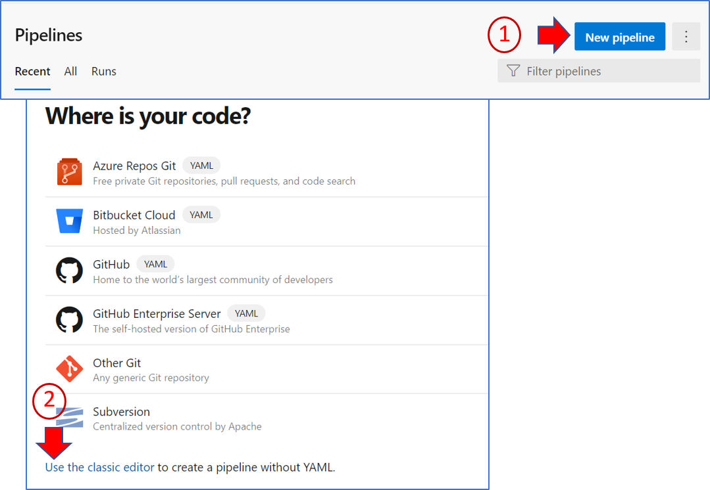
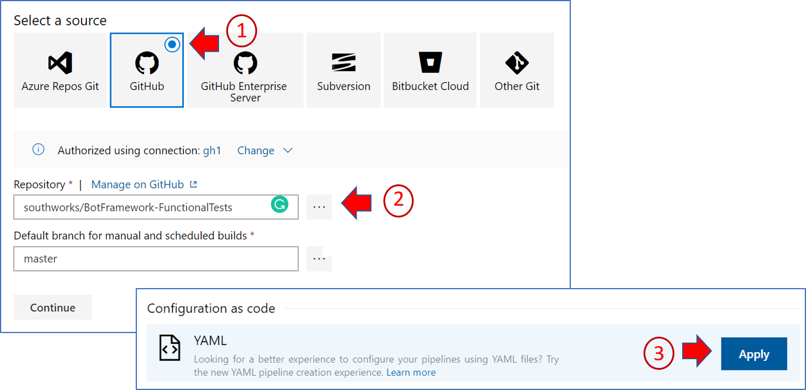

# Skills Functional Tests

### Summary

Skill functional testing aims to automate the testing matrix for Bot/Skill interactions in all available programming languages.

| Host\Skill      | DotNet  | JavaScript  | Python  |
|---------------- |-------- |------------ |-------- |
| **DotNet**      |         |             |         |
| **JavaScript**  |         |             |         |
| **Python**      |         |             |         |

### Content

This section contains a `SimpleHostBot` and an `EchoSkillBot` sample for each language available to be used in the functional tests. To run the test we use YAML files to set up a pipeline that deploys a pair of Host and Skill bots to Azure and then run functional tests where the HostBot consumes the SkillBot.

The functional tests are located in the `tests` folder. This test is written in DotNet and can be used to test the bots independently of the language these are written in. For this, the test communicate with the bots deployed to Azure using a [direct line channel](https://docs.microsoft.com/en-us/azure/bot-service/bot-service-channel-directline) to the `HostBot`, and ask it to be delegated to the skill to then get an echo message.

## Usage

To run the functional tests, you have to set up a pipeline in Azure DevOps for each pair of combinations of different languages of host-skill, using the YAML files in the folder `build/yamls` at the root of the repository.

### Prerequisites

To run a pipeline with the functional test you will need:

- Azure DevOps Organization
- Azure Portal Subscription

### Set up pipeline

The following steps will guide you trough the creation of a pipeline that runs one of the YAMLs with the functional test for a pair of Host and Skill bots. If you want to test every combination, you have to create one pipeline for each pair, following these instructions for each.

1. Go to your Azure DevOps organization, go to the pipeline's section and create a new pipeline using the classic editor.

2. Configure the repository and branch. Then, in the configuration as code section, click on **_Apply_** for the YAML file option.

3. In section YAML, write the build name and select the YAML file inside the folder build/yaml in the root of the directory.

  
   In the following table, you can see which YAML corresponds with each host-skill pair to be tested.

   | Host\Skill      | DotNet                                                                   | JavaScript                                                                            | Python  |
   |---------------- |------------------------------------------------------------------------- |-------------------------------------------------------------------------------------- |-------- |
   | **DotNet**      | [dotnetHost2dotnetSkill.yml ](../build/yaml/dotnetHost2dotnetSkill.yml ) |                                                                                       |         |
   | **JavaScript**  |                                                                          |[javascriptHost2javascriptSkill.yml ](../build/yaml/javascriptHost2javascriptSkill.yml)|         |
   | **Python**      |                                                                          |                                                                                       |         |

4. In the variables section add the following variables.

   | Name                   | Source                                                                                                         | Description                                                                                          |
   |----------------------- |--------------------------------------------------------------------------------------------------------------- |----------------------------------------------------------------------------------------------------- |
   | **HostAppId***         | [App Registration](https://portal.azure.com/#blade/Microsoft_AAD_RegisteredApps/ApplicationsListBlade) Portal  | The *Application (client) ID* of the App Registration for your HostBot.                              |
   | **HostAppSecret***     | [App Registration](https://portal.azure.com/#blade/Microsoft_AAD_RegisteredApps/ApplicationsListBlade) Portal  | The secret’s value from the table under *Client secrets* of the App Registration for your HostBot.   |
   | **SkillAppId***        | [App Registration](https://portal.azure.com/#blade/Microsoft_AAD_RegisteredApps/ApplicationsListBlade) Portal  | The *Application (client) ID* of the App Registration for your SkillBot.                             |
   | **SkillAppSecret***    | [App Registration](https://portal.azure.com/#blade/Microsoft_AAD_RegisteredApps/ApplicationsListBlade) Portal  | The secret’s value from the table under *Client secrets* of the App Registration for your SkillBot.  |
   | **AzureSubscription**  | User                                                                                                           | The name of the *Azure Resource Manager service connection* configured in the pipeline.              |
   | **BotGroup**           | User                                                                                                           | The name of the Resource Group your bots will use to be deployed to Azure.                           |
   | **HostBotName**        | User                                                                                                           | The name of the HostBot that will be used to deploy it to Azure.                                     |
   | **SkillBotName**       | User                                                                                                           | The name of the SkillBot that will be used to deploy it to Azure.                                    |
   | **DeleteResourceGroup** _(Optional)_| User                                                                                              | Set this variable to **false** if you want to skip the step to delete the resources in Azure after the tests.|
   | **SdkVersion** _(Optional)_| User     | The version of the BotBuilder SDK the bots will use. If not set, the latest preview version will be used, set it to **stable** to install latest stable version or specify the version you want to use.|

   *Set these variables as private.

5. (Optional) Configure the triggers for the pipeline. By default, this pipeline runs every night at midnight.
