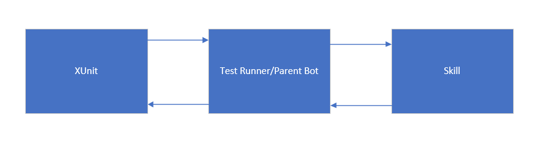
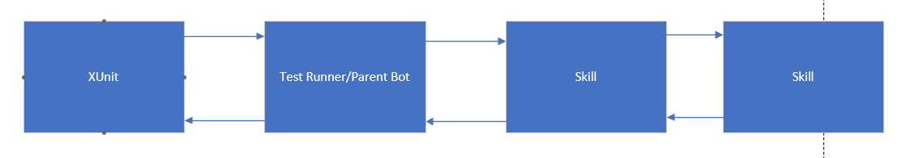
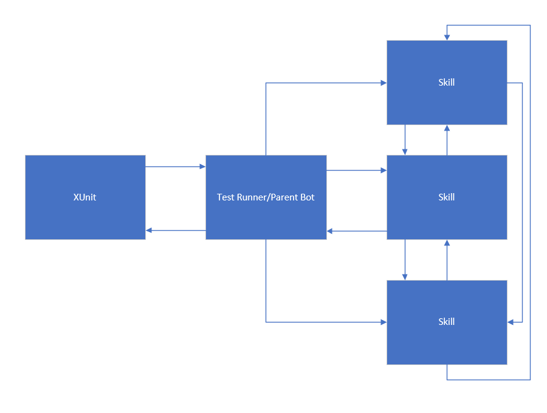

# Transcript based test runner (DRAFT) <!-- omit in toc -->

## Summary <!-- omit in toc -->

We should use a 3-phase approach to test skills. First, we should implement a Page Object-like model. Next we should modify that model to allow "Pages" (read skills) to call/interact with other skills. Finally we should enable a graph-based approach to testing. I think this is the right way to do this because at the end of the day the truly valueable thing about skills is the arbritary extensibility of one skill to another skill. That extensibility is very hard to test in a meaingful way. It's much easier to write a test that says "Here is a connected bi-directional graph. Randomly pick a neighbor. Randomly select an action that neighbor can do, then pick one of its neighbors. Repeat this process N times and assert state and confirm no errors. Repeat this entire process N times, assert state and no errors. 

## Phase 1 Page Object



In the modified Page Object Model the XUnit tests will interact with the "Page Object" (read Test Runner) that is a single parent bot. The parent bot knows about a skill bot and knows what commands that bot support. The parent bot will be responsible for calling into the skill bot, sending a command in the form of an activity and receiving a response from the skill, and forwarding that back to Xunit for validation. 

Xunit tests should look something like this:

```
var activity = SendActivity(bot=Constants.EchoSkillBot, command=Constants.EchoSkillBot.echoHello)
Assert(activity.text, Constants.EchoSkillBot.echoHello)
```

This is, more or less, what we have today excluding the small amount of Page Objectification. This allows us to cover highly structured and uninteresting scenarios to ensure all of the piping works. 

We can also add the piping in this phase (or in its own phase) the ability to use transcript files as tests that we replay. 

## Phase 2 Page Object with a little graph


In this phase we will enable known scenarios where a skill needs to call another skill. We should also add the ability to programatically test multi-turn conversations. We can probably use some of the work I did with Teams integration testing here. This will result in more complext testing scenarios, and a semi-connected graph. We will also light up the ability to do negative and error testing here. 

## Phase 3 Graphs



In this phase we will build the ability to write the test that's at the end of the summary. That's not to say there won't be specific tests that we will still test explicitly, but this will add our ability to do random regression testing without any meaingful additional cost. 

## Contents <!-- omit in toc -->
- [Phase 1](#phase-1-page-object)
- [Phase 2](#phase-2-page-object-with-a-little-graph)
- [Phase 3](#phase-3-graphs)
- [Requirements](#requirements)
- [Implementation notes](#implementation-notes)
- [Other considerations and TODOs](#other-considerations-and-todos)

## Requirements

1. I can run functional tests from visual studio
2. I can run functional tests from the command line
3. I can run functional tests from a CI/CD pipeline in Azure DevOps
4. I can take a transcript created using the Emulator and run it against a deployed bot
5. I can emulate a channel from my tests (Emulator, Teams, WebChat)
6. I get clear messages describing where my test failed so I can debug it
7. I can debug a test step by step from the IDE
8. I should be able to use expressions in my expected bot responses to be able to deal with variable data
9. I should be able to run my tests against a bot running in localhost
10. We should write unit tests to make sure the runner classes and be easy to maintain


## Implementation notes

1. The first version of the runner will be in C# targeting DotNet Core 3.1
2. We will rely on XUnit to write the tests but let's try to keep it out of the base classes (if possible)
3. The test runner should be able to load its settings from configuration using IConfiguration
4. The code should follow the SyleCop and FxCop ruleset used by the dotnet SDK
5. (Not a P0), we may be able to refactor some of the code in the test runner and make it part of the SDK testing package in the future

## Other considerations and TODOs
There are some things that can be problematic so I wanted to call them out. 
1. Without the multi-turn reply functionality it will be difficult to write tests that require user input/interaction. 
2. There will need to be a separate set of tests to validate messages coming from the various channels actually work as intended. This subset of tests should function much like a smoke test. 
3. If we wanted to get really fancy about things we Dan Driscol said he's not against having bots test other bots so we TECHNICALLY could solve the user interactivity problem solved with another bot. 
4. We could skip the 3-phase approach and jump straight to graphs, but this way we could 
5. Do we create a tool to convert a transcript into a test script that removes some of the noise in the transcript and makes test easier to read and write?

