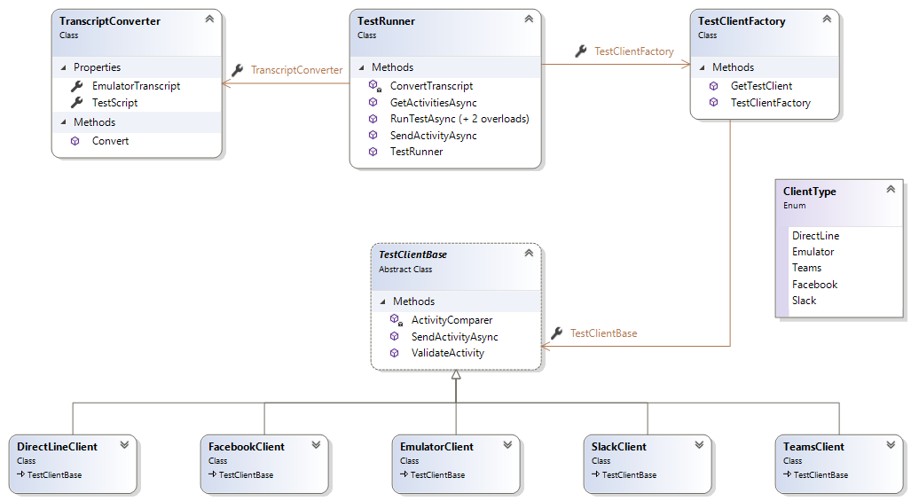
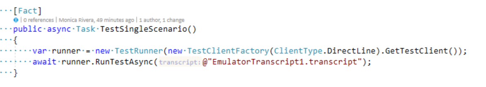
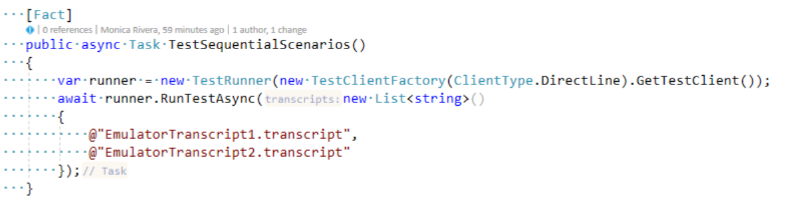
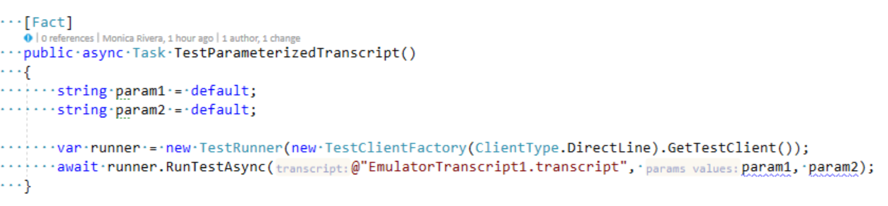
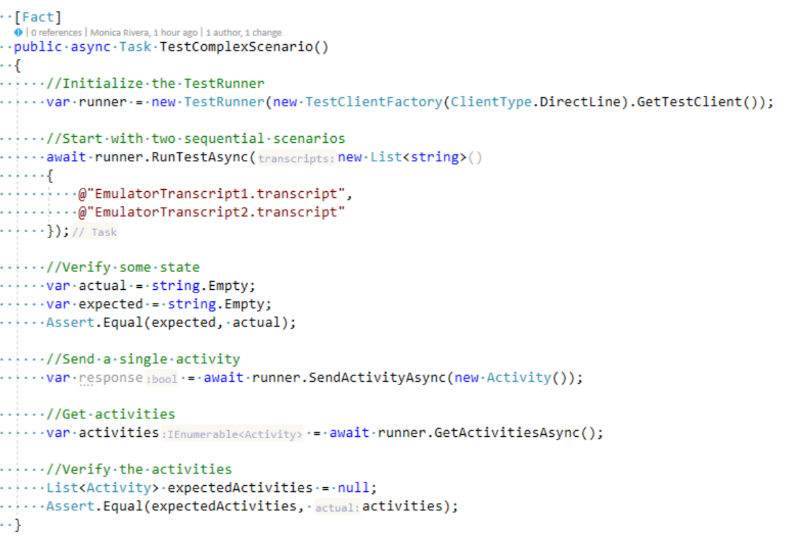

# Transcript based test runner (DRAFT) <!-- omit in toc -->

## Summary <!-- omit in toc -->

Transcript based functional tests aim to allow us to test complex conversation flows against a bot and related skills end to end without having to worry about how the bot is implemented.

## Contents <!-- omit in toc -->

- [Requirements](#requirements)
- [Design notes](#design-notes)
- [TestRunner Class](#testrunner-class)
  - [Methods](#methods)
- [Implementation notes](#implementation-notes)
- [Other considerations and TODOs](#other-considerations-and-todos)
- [Test Script file](#test-script-file)

## Requirements

1. I can run functional tests from visual studio
2. I can run functional tests from the command line
3. I can run functional tests from a CI/CD pipeline in Azure DevOps
4. I can take a transcript created using the Emulator and run it against a deployed bot
5. I can emulate a channel from my tests (Emulator, Teams, WebChat)
6. I get clear messages describing where my test failed so I can debug it
7. I can debug a test step by step from the IDE
8. I should be able to use expressions in my expected bot responses to be able to deal with variable data
9. I should be able to run my tests against a bot running in localhost
10. We should write unit tests to make sure the runner classes and be easy to maintain

## Design notes

Here is a high level class diagram to get started

- `TestRunner`: responsible for executing the `TestScript` using the desired `TestClientBase`
- `TranscriptConverter`: responsible for reading a transcript, converting it into a sequence of steps and returning the steps to be executed. Input: an emulator transcript file. Output: a "Test Script" file.
- `TestClientFactory`: creates an instance of a TestClient implementation.
- `TestClientBase`(abstract): base class for implementing channel specific test clients
- `_XYZ_Client`: specialized client that knows how to interact with a specific channel (it should be capable of generating channel OAuthTokens, handle responses coming from that specific channel, etc.)
- `ClientType` (enum): types are: DirectLine, Emulator, Teams

## TestRunner Class
### Methods
- `RunTestAsync(string)`  Executes a single scenario based on the transcript passed to the method.   
    * _Parameters_   
        * transcript `string`    The transcript that contains the scenario to execute.  
    * _Returns_  
A `Task`.    

    * Sample Usage   

- `RunTestAsync(IEnumerable<string>) ` 
Executes a test based on a collection of transcripts, in sequence, in the order in which they exist in the collection. This method can be used to compose a complex scenario formed by a set of smaller scenarios defined in each transcript.  
    * _Parameters_   
        * transcripts `IEnumerable<string>` The collection of transcripts to execute.  
    * _Returns_  
A `Task`.   

    * Sample Usage    

- `RunTestAsync(string, params string[])`  Executes a scenario utilizing a parameterized transcript.    
    * _Parameters_      
        * transcript `string`    The parameterized transcript that contains the scenario to execute.  
        * values `params string[]`    The parameters to be passed to the transcript.    
    * _Returns_  
A `Task`.  
    * Sample Usage  

- `SendActivityAsync(Activity)`  Sends a single Activity to the test bot.    
    * _Parameters_    
        * activity `Microsoft.Bot.Schema.Activity`  The Activity that is sent to the bot.    
    * _Returns_
A `Task<bool>`

- `GetActivitiesAsync()`  Gets a collection of activities returned by the bot.    
    * _Parameters_    
        * None.
    * _Returns_
A `Task<IEnumerable<Microsoft.Bot.Schema.Activity>>`   
* Complex Test Scenario Example   

## Implementation notes

1. The first version of the runner will be in C# targeting DotNet Core 3.1
2. We will rely on XUnit to write the tests but let's try to keep it out of the base classes (if possible)
3. The test runner should be able to load its settings from configuration using IConfiguration
4. The code should follow the SyleCop and FxCop ruleset used by the dotnet SDK
5. (Not a P0), we may be able to refactor some of the code in the test runner and make it part of the SDK testing package in the future

## Other considerations and TODOs

- Can we use Adaptive expressions to create asserts?
- Do we create a tool to convert a transcript into a test script that removes some of the noise in the transcript and makes test easier to read and write?
- Do we implement _XYZ_Options classes to configure the runner, the test script and the test client?
- Possible feature - chaining test scripts, consider we have a welcome part that we do over and over again and want to combine with the book a flight or get weather. The welcome portion and assertions can be written once and then we can append the other scenarios. 

## Test Script file

It is generated by the TranscriptConverter from an Emulator transcript. The test script file contains the list of Activities found in its corresponding Emulator transcript with the following properties removed:
* All IDs
* All timestamps